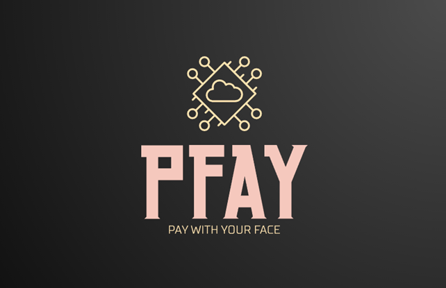
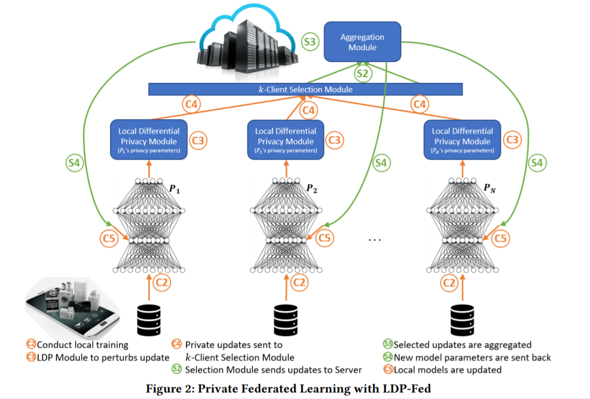
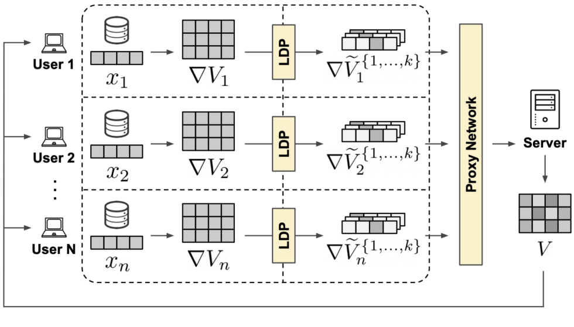

 
  

# 
 PFAY: Decentralized biometric payment system

#  1. Problem statement:

The transaction value for the Global Digital Payments Market was USD 5.44 trillion in 2020, and it is projected to be worth USD 11.29 trillion by 2026 by Berkshire&#39;s analysts, registering a CAGR of 11.21% during the period of 2021-2026. This demand for cashless payments was driven by greater convenience, favorable government policies, and evolving consumer behavior.

In parallel, blockchain technology, a disruptive factor in the financial market, with the market valued estimated to be USD 5.4 billion in 2021 and the sector is growing at an unprecedented speed.

Along this rapid growth outlines a cyber-security concern for the usage of such digital payment systems. In the case of offline thefts, damages are only subject to the available amount of cash the person is carrying. However, in digital transactions, the damages can be irrevocable.

At the user level, specifically in the streaming and digital content creation industry, we see some inefficiency and obscurity in **donation** and **fundraising,** whereby middlemen take a hefty cut of overall earning, the profits are not publicly known and verified by users. In addition, a cost-effective and trusted solution for small amount transactions between family and friends using biometric authentication should be convenient

So our solution is to implement a blockchain ledger integrated with a biometric authentication system to ensure user data privacy, also offering ease of use for transacting and authenticating. This system should be able to efficiently transact digital goods by using biometric authentication while keeping all of the users&#39; data securely on their devices. Especially, our system allow user to pay by scanning other people face. This would be extremely convenient method to donate for content creator, streamer, or sending money to friends and family members.

#  2. Solution and advantages:

###  a. Blockchain ledger with biometrics authentication, ease of use:

Thanks to recent advances in machine learning detection algorithms and the sensor industry, biometrics authentication is gaining widespread popularity for being both secure and cost-effective (according to a Visa survey, two-thirds of Europeans want to use biometrics as a method of payment authentication).

In our setting, the metric is FaceID. It is considered highly secure and when integrated with other methods to form a multi-factor authentication, cyber penetration is unlikely. Our algorithm should adapt with user FaceID over time as they gradually use the system. In case of a sudden change (surgery, big beard cut, etc), a passcode will be used to re-registered biometrics information.

###  b. Technical jargons:

 **i. Methods of learning** : LDP-Fed (Federated Learning with Local Differential Privacy Module)

  

 <a href="https://arxiv.org/abs/2006.03637"> [arXiv:2006.03637]cs.[LG] </a>

&nbsp;&nbsp; There will be 3 main components of the network: **User** (or referred to as clients), **Proxy Network** (or k-Client Selection Module), and **Sever.** As the name suggested, users will be mobile devices or small-scale participants in the network, the proxy is used to performing data aggregation, communicating users with the server, while the server is used to update each pass or iteration of the algorithm globally.

*Details about each component are provided below:*

 
 

 <a href="https://brave.com/federated-learning/" align="center"> https://brave.com/federated-learning/ </a>

**&nbsp;&nbsp;&nbsp; Client &amp; LDP Module:  **
Initially, each client randomly initializes its own local user embedding **xu**. The client is tasked with continuously processing the incoming item matrix **V** from the server and using it to update the local user embedding and producing a local item matrix gradient update **∇V**. The client never shares its local user embedding with anyone. The local item matrix update is privatized (masked) by the **LDP module** and shared safely with the proxy network. Once the training has finished, the client can use its local embedding in conjunction with the latest item matrix received. This update is to make sure that the model can adapt to changes in facial details over time.

**&nbsp;&nbsp;&nbsp; Proxy Network:  **
Once the privatized updates reach the proxy network, these are stripped of their metadata (i.e. IP address), split into single updates, shuffled with the updates from other users to break any existing timing patterns, and finally, forwarded to the server. The proxy network takes care of breaking linkability between the streams of multiple updates coming from each client at each epoch. This reduces the user fingerprinting surface and prevents the recommender from building any longitudinal representation of the user, both within and across epochs.

**&nbsp;&nbsp;&nbsp; Server:  **
At the very beginning, the server randomly initializes an item matrix, which constitutes the global part of the shared model. This is shipped to all the clients to initiate the federated learning process in epoch 0. At each epoch, once enough privatized gradient updates reach the server, they are aggregated together to reconstruct a global item matrix update ∇V. This is used to compute an updated item matrix V′, which is then shipped to each client to initiate the next federated learning epoch.

  **ii. Model Architecture:** FaceNet with MTCNN for input processing: Input &rarr; MTCNN &rarr; FaceNET &rarr; 512 features output vector.

  **iii. The blockchain ledger:** Refer to future development. Plan to use existing resources in ETH&#39;s ecosystem.  
** *Due to time constraint of the hackathon, only a prototype for face recognition system is being developed. In the future, the ledger along with all functionalities might be completed and the apps can be deployed for community usage. Currently, we plan to have a blockchain build on top of Ethereum and utilize their existing ecosystem (**Golem:** utilizing, scaling up computing system; **Raiden:** transaction and multi-party payments; **Gnosis:** market analysis and trading platforms)* **

###  c. Functions and requirements:
  1. **Payment methods:** pay by usual methods (wallet address, QR codes), and especially can pay by scanning face if user is registered (using biometrics ID).
  2. **Machine learning algorithm:** can accurately identify users by faceID, need to research on aggregation methods and communication efficiency.
  3. **The MVP:** should be able to recognize human faces, allow user to use all payment methods, and have a working database system.
  4. **MFA (multi-factor authentication)**: Along with FaceID, touchID, passcode, pin, or registered devices can be used as extra factors to create a practically impenetrable system.
  5. **Referral system:** while scaling up, we believe giving a reward by issuing a token would be a logical move to incentivize more people to join our network.
  6. **Infrastructure:** Once the network and machine learning workflow are established, many potential problems could come as demand for different kind of services would appear. This would open more opportunity and challenge for applying deep learning technologies. A few we can think of now is insurance, investment management, and on-demand application.
 
###  d. What we offer:

  1. **Globalization and performance:** Thanks to blockchain, we can share computing resources, reduce duplicate records keeping, and eliminate the need for financial institution to verify transaction.
  2. **Secure:** Achieved with blockchain and multi-factor authentication.
  3. **Privacy:** Source codes and machine learning models are open sources so it eliminates all trust issues. In addition, users&#39; data security can be achieved by federated learning method.
  4. **Simplicity:** It&#39;s as simple as opening your own smartphone with faceID, but now you have access to all banking services.
  5. **Multiple services:** Other services using machine learning can be fulfilled by this approach.

#  3. Challenge and competition:

The Digital Payments Market is moderately concentrated. The competitive rivalry in the market studied is moderate, as a good number of players prevail. Despite the existence of several companies in the market studied, firms are required to keep innovating their products, in order to gain a sustainable competitive edge over their rivals and provide product differentiation.

In addition, here are many predecessors in the digital payment industry, with large-scale investment and funding for a variety of projects. To name a few competitors:

- Google Pay
- Visa 
- Paypal

However, we believe our approach would benefit from the rapid development of the blockchain sector as well as machine learning technologies. Besides, though biometrics authentication is widely applied, the idea of paying by using biometrics ID on blockchain is relatively new and exciting.
 
**Regarding future challenges, we think there will be many things needed to improves:**
- **Machine learning algorithm:** our FaceID for the prototype needs to improve as it currently only captures 2D input features, we wish to enhance the model to capture more advanced features such as depth map, multi-pose representations (for users who wear glasses, beards, or makeup).  
- **Database:** Requirements are robust and elastic, as we want performance and scalability in the future  
- **Ledger:** 
- **Incentive mechanism:** We think of issuing a token, giving sign up, referral, and resources contributing reward.  

#  4. Roadmap: To be decide in the future.

# References:  
  https://brave.com/federated-learning/  
  https://arxiv.org/abs/2006.03637  
  https://github.com/pytorch/android-demo-app  
  https://towardsdatascience.com/facial-recognition-login-system-using-deep-learning-reactjs-61bff981eb74  
  https://heartbeat.comet.ml/deploying-pytorch-and-keras-models-to-android-with-tensorflow-mobile-a16a1fb83f2  
  https://bps.money/?fbclid=IwAR0A5mqqFhycuMzl0mwKlQ8E9XDAAREiXwcRIfShnRLKCdUZ0td43r3OrNI  
****
