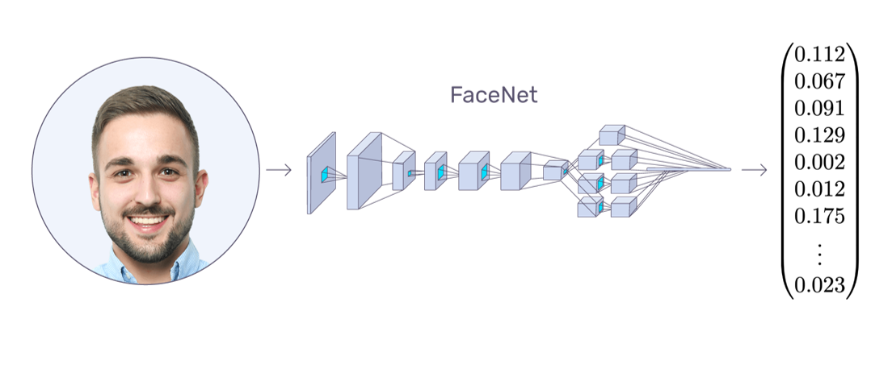

  

# 
 **PFAY: Biometric payment system**

#  1. Problem statement:

The transaction value for the Global Digital Payments Market was USD 5.44 trillion in 2020, and it is projected to be worth USD 11.29 trillion by 2026 by Berkshire&#39;s analysts, registering a CAGR of 11.21% during the period of 2021-2026. This demand for cashless payments was driven by greater convenience, favorable government policies, and evolving consumer behavior.

In parallel, streaming, another young and rapid growing industry, which was valued USD 57.8 billion in 2020, is expected to double its value to USD 109 bn by 2025.

Along this rapid growth outlines a cyber-security concern for the usage of such digital payment systems. In the case of offline thefts, damages are only subject to the available amount of cash the person is carrying. However, in digital transactions, the damages can be irrevocable.

At the user level, specifically in the streaming and digital content creation industry, we see some inefficiency and obscurity in **donation** and **fundraising**, whereby users have to go through complicated middlemen platform to support their content creator. In addition, there was limited way of transacting money to friend and family members while they are abroad.

So our solution is to implement a biometric payment system called PFAY, where you can "pay with your face". This offer an ease of use for transacting and authenticating, while in the mean time, outlining a convenient way to transact money between people in the network.

#  2. Solution and advantages:

###  a. Biometrics authentication, ease of use:

Thanks to recent advances in machine learning detection algorithms and the sensor industry, biometrics authentication is gaining widespread popularity for being both secure and cost-effective (according to a Visa survey, two-thirds of Europeans want to use biometrics as a method of payment authentication).

In our setting, the metric is FaceID. It is considered highly secure and when integrated with other methods to form a multi-factor authentication, cyber penetration is unlikely. Our algorithm should adapt with user FaceID over time as they gradually use the system. In case of a sudden change (surgery, big beard cut, etc), a passcode will be used to re-registered biometrics information.

###  b. Face recognition system:

  **Model Architecture:** Face  Net with MTCNN for input processing:

  
  
 
  
 Input &rarr; FaceNET &rarr; embedded feature vectors 

FaceNet is a face recognition system developed by Google, it achieved state of the art result on multiple dataset. The network take an image of the person’s face as input and outputs a embedded features vector. This is then being used to compare with other embedded vector to measure the similarity between 2 faces. We use this as our model for face authentication.

###  c. Functions and requirements:
  1. **The prototype:** User can pay and register by FaceID, prototype should have a minimal but working database
  2. **Machine learning algorithm:** record depth map and multi-pose representation of human faces, also need to research on aggregation methods and communication efficiency with server.
  3. **Payment method:** along with FaceID, it should support by all traditional payment methods.
  4. **MFA (multi-factor authentication)**: For security. Could use biometricID integrated with other traditional authentication methods
  5. **Infrastructure:** Once the network and machine learning workflow are established, many potential problems could come as demand for different kind of services would appear. This would open more opportunity and challenge for applying deep learning technologies. A few we can think of now is insurance, investment management, and on-demand application.
  6. **Multi-way payment:** A special convenient feature we would like to offer. This allow user to pay multi-party at once by scanning a Photo with multiple face insides. This would be extremely convenient in case of bill sharing in restaurants or gifts pay-out.
 
###  d. What we offer:

  1. **Globalization:** Payment can be made to anyone on the planet, with just faceID. 
  2. **Secure:** Biometric authentication, especially FaceID is considered to be highly secure, can be integrated with other methods to form a multi-factor authentication.
  3. **Simplicity:** It&#39;s as simple as opening your own smartphone with faceID, but now you have access to all banking services.
  4. **OneStop finance:** It could be a one stop for finance where we offer financial services. 

# References:  
  https://github.com/pytorch/android-demo-app  
  https://towardsdatascience.com/facial-recognition-login-system-using-deep-learning-reactjs-61bff981eb74  
  https://heartbeat.comet.ml/deploying-pytorch-and-keras-models-to-android-with-tensorflow-mobile-a16a1fb83f2  
  https://bps.money/?fbclid=IwAR0A5mqqFhycuMzl0mwKlQ8E9XDAAREiXwcRIfShnRLKCdUZ0td43r3OrNI  
****
